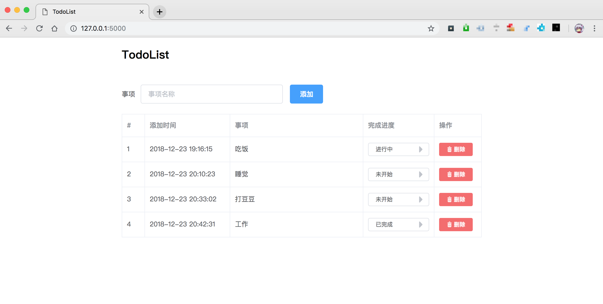

# TodoList



## 运行方式

```
$ python run.py
```
访问：http://127.0.0.1:5000/

## 使用框架
Flask + Vue.js + ElementUI

## 项目目录
```
.
├── README.md
├── run.py
├── app_api
│   ├── __init__.py
│   ├── models.py
│   ├── todolist.db
│   ├── urls.py
│   └── views.py
├── app_html
│   ├── __init__.py
│   ├── urls.py
│   └── views.py
├── images
│   └── main.png
├── static
│   ├── css
│   │   ├── element-ui@2.4.11.css
│   │   ├── fonts
│   │   │   └── element-icons.woff
│   │   └── main.css
│   └── js
│       ├── axios@0.18.0.min.js
│       ├── element-ui@2.4.11.js
│       └── vue@2.5.21.min.js
└── templates
    └── index.html

```

## 参考文档
Vue.js：https://cn.vuejs.org/

ElementUI： http://element-cn.eleme.io/

flask-restful： https://flask-restful.readthedocs.io/

flask：http://flask.pocoo.org/

## 遇到的坑
### 1、Uncaught DOMException
```
Uncaught DOMException:
Failed to execute 'setAttribute' on 'Element': ',' is not a valid attribute name.
```
解决：
html文件中，发现属性之间多了一个逗号
```html
<el-button type="primary", @click="addItem">添加</el-button>
```
去掉逗号`,` 就好了
```html
<el-button type="primary" @click="addItem">添加</el-button>
```

>参考:
>https://blog.csdn.net/xuelang532777032/article/details/78356657

### 2、刷新网页出现未渲染的页面
正常来说都是先加载页面，最后加载js
现在要先加载js，再加载页面

>参考:
>https://www.cnblogs.com/chuanzhou/p/7467655.html

### 3、flask不渲染页面直接返回
flask使用的jinja2的模板也用`{{ }}`插值替换，所以会和Vue.js的模板渲染冲突

要实现前后端分离，后端提供原始页面和 接口，前端渲染，就要直接返回原始页面
```python
from flask import Flask, send_file

app = Flask(__name__)

@app.route('/')
def index():
    return send_file("index.html")

if __name__ == '__main__':
    app.run()
```

>参考：
>https://segmentfault.com/q/1010000012132103/a-1020000012132189


### 4、el-select 触发change 事件
```html
<el-select v-model="value" placeholder="请选择" @change="updateItem">
    <el-option
        v-for="item in options"
        :key="item.value"
        :label="item.label"
        :value="item.label">
    </el-option>
</el-select>

```
>参考：
>https://blog.csdn.net/zjsfdx/article/details/80279752

### 5、axios发送post请求后端接收不到的问题
axios发送post请求是payload方式，也就是发送json
flask 需要使用json方式接收数据

```python
request.json.get()
```

>参考：
>https://www.jianshu.com/p/b22d03dfe006

### 6、vue通过ajax传递数据
使用axios

### 7、element-ui 图标显示不正常
将js和css下载到本地，发现没有字体库，官网竟然不提供字体库的下载链接
解决办法：

先将element-ui 提供的CDN文件拷贝到需要的文件中，替换本地引入，观察网络请求

找到字体文件，下载到本地即可

```html
<!-- 引入样式 -->
<link rel="stylesheet" href="https://unpkg.com/element-ui/lib/theme-chalk/index.css">
<!-- 引入组件库 -->
<script src="https://unpkg.com/element-ui/lib/index.js"></script>
```

找到的字体文件请求
https://unpkg.com/element-ui@2.4.11/lib/theme-chalk/fonts/element-icons.woff

>参考：
>https://blog.csdn.net/m0_37893932/article/details/79460652

### 8、设置element-UI的input宽度

```html
style="width:100px"
```
>参考
>https://blog.csdn.net/liukai6/article/details/80090812

## 附录
资源下载：
https://unpkg.com/element-ui/lib/theme-chalk/index.css

https://unpkg.com/element-ui/lib/index.js

https://unpkg.com/axios@0.18.0/dist/axios.min.js

https://unpkg.com/element-ui@2.4.11/lib/theme-chalk/fonts/element-icons.woff


发现一个vue.js 和 element 搭建的一个后台管理界面,可供参考：

https://github.com/taylorchen709/vue-admin
